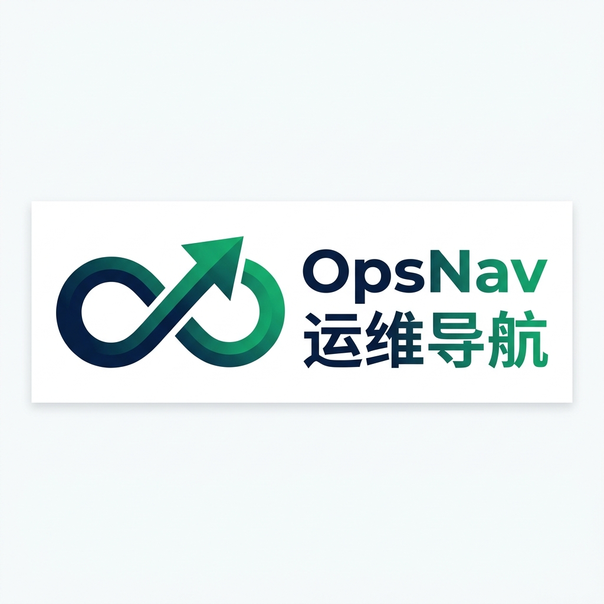

简体中文 | [English](README.en.md)

<div align="center"></div>

<p align="center">
  <b>File Share Manager - 面向团队工作空间的开源文件共享与治理平台</b><br/>
  基于 Go/Gin/GORM、Vue 3、Element Plus 和 MySQL 8，提供工作空间文件管理、分片上传、版本管理、外链分享、权限审计、备份恢复和存储健康治理能力。
</p>

<p align="center">
  <a target="_blank" href="https://github.com/ghl1024/file-share-manager">
    
  </a>
  <a target="_blank" href="https://github.com/ghl1024/file-share-manager">
    
  </a>
  <a target="_blank" href="https://www.apache.org/licenses/LICENSE-2.0">
    
  </a>
  <a target="_blank" href="https://gitee.com/ghl1024/file-share-manager">
    
  </a>
</p>

<div align="center">
  
  
  
  
  
  
</div>

---

## 目录

- [一、项目简介](#section-1)
- [二、系统架构](#section-2)
- [三、功能模块](#section-3)
- [四、系统预览](#section-4)
- [五、项目文档](#section-5)
- [六、部署方案](#section-6)
- [七、登录与验证](#section-7)
- [八、运行配置](#section-8)
- [九、贡献指南](#section-9)
- [十、开源协议](#section-10)

---

<a id="section-1"></a>

## 一、项目简介

### 1.1 File Share Manager 主要解决以下问题

- 以工作空间为边界集中管理文件、目录、成员、用户组、角色和按钮级权限。
- 支持大文件分片上传、断点续传、覆盖上传版本冲突检查、文件版本恢复和安全下载。
- 对外链分享创建不可变文件版本或目录快照，匿名访问不暴露真实路径、工作空间和对象存储地址。
- 对上传内容进行扩展名白名单、Magic Number、Office 压缩包结构、VBA 宏一致性和 ZIP 安全检查。
- 可选接入 ClamAV，对上传文件和手动重扫结果进行病毒扫描、失败重试和状态展示。
- 将审计日志按全局或工作空间维护流序号和哈希链，支持筛选、导出、链校验和加密归档。
- 通过备份链、恢复演练、增量压缩、隔离区复核和存储健康探针降低误删和存储故障风险。
- 使用通知 Outbox、后台 Worker 和持久任务表处理批量下载、审计导出、生命周期清理和可靠投递。

### 1.2 File Share Manager 适用场景

- 团队、部门或项目级文件共享，要求成员权限和工作空间隔离。
- 需要可审计的上传、下载、分享、删除、恢复和管理员操作记录。
- 对文件扩展名、压缩包结构、病毒扫描、外链失效和下载次数有治理要求的内部平台。
- 希望同时保留在线文件对象、本地或对象存储备份、归档和恢复演练能力的运维场景。
- 已经使用 MySQL、Nginx、Docker Compose、S3/MinIO/OSS 或 LDAP 的中小型部署环境。

### 1.3 开源地址

| 平台 | 地址 |
| --- | --- |
| GitHub | [github.com/ghl1024/file-share-manager](https://github.com/ghl1024/file-share-manager) |
| Gitee | [gitee.com/ghl1024/file-share-manager](https://gitee.com/ghl1024/file-share-manager) |
| CNB | [cnb.cool/ghl1024/file-share-manager](https://cnb.cool/ghl1024/file-share-manager) |
| GitCode | [gitcode.com/haydenguo/file-share-manager](https://gitcode.com/haydenguo/file-share-manager) |
| 作者主页 | [hayden.pub](https://hayden.pub) |

---

<a id="section-2"></a>

## 二、系统架构

[](docs/架构/runtime-architecture.html)

### 2.1 架构概览

| 模块 | 说明 | 详细文档 |
| --- | --- | --- |
| Frontend | Vue 3 管理控制台，提供登录、工作台、工作空间、文件目录、分享、审计和系统管理页面 | [frontend/README.md](frontend/README.md) |
| Server | Go/Gin 后端，提供 `/api/fileshare/v1` API、认证授权、业务编排、后台 Worker 和数据持久化 | [docs/架构/runtime-architecture.md](docs/架构/runtime-architecture.md) |
| MySQL | 保存用户、工作空间、角色权限、文件版本、分享、审计、备份任务和通知 Outbox | [server/configs/config-dev.toml](server/configs/config-dev.toml) |
| POSIX Storage | 保存上传暂存分片、标准文件对象、批量下载 ZIP、隔离区和本地备份目录 | [server/internal/storage/posix.go](server/internal/storage/posix.go) |
| Backup Storage | 支持 local、S3、MinIO、OSS 作为备份、归档和审计归档对象后端 | [server/internal/storage/backup_factory.go](server/internal/storage/backup_factory.go) |

### 2.2 技术栈

| 层次 | 主要技术 |
| --- | --- |
| Frontend | Vue 3.5、Vite 6.4、Vue Router 4、Pinia 3、Element Plus 2.14、Axios |
| Server | Go 1.26.5、Gin 1.12、GORM、MySQL Driver、zap、OpenTelemetry Trace |
| 认证与权限 | JWT HS256、HttpOnly Cookie、bcrypt、LDAP、工作空间 RBAC、菜单/按钮权限 |
| 文件与安全 | POSIX 原子写入、分片上传、SHA-256、MIME 检查、ZIP 安全检查、ClamAV |
| 任务与可靠性 | MySQL 持久队列、进程内 Worker、通知 Outbox、任务 claim/requeue、指数退避 |
| 备份与归档 | 本地目录、S3、MinIO、OSS、AES-256-GCM manifest、备份链校验和恢复演练 |

### 2.3 核心数据流

1. 用户访问 `/fileshare/`，Nginx 提供 Vue 静态资源，前端通过 `/api/fileshare/v1` 访问后端。
2. 登录成功后后端签发 `fileshare_session` HttpOnly Cookie；管理 API 进入认证、审计、工作空间上下文和权限中间件。
3. 文件上传先创建 MySQL 上传会话，再把分片写入 staging；完成时合并为 `objects/<workspace_id>/<uuid>`，校验 SHA-256 和内容结构。
4. 文件版本、节点、配额、分享快照和审计事件由 DAO/GORM 写入 MySQL，文件二进制对象留在 POSIX 或归档存储。
5. 批量下载、生命周期清理、审计导出/归档、通知投递、存储健康、备份压缩、ClamAV 重试和 LDAP 同步由同一 Server 进程内 Worker 执行。
6. 备份和归档任务读取 MySQL 元数据与文件对象，写入 local/S3/MinIO/OSS，并通过清单、摘要和链锚点校验可恢复性。

---

<a id="section-3"></a>

## 三、功能模块

| 功能域 | 主要能力 |
| --- | --- |
| 工作空间 | 创建空间、成员管理、成员配额、可用用户查询、跨空间访问审计 |
| 用户与组织 | 本地账号、LDAP 配置与同步、用户状态、密码重置、用户组和成员关系 |
| 文件目录 | 根目录、目录树、文件夹创建、重命名、移动、收藏、最近访问、回收站 |
| 上传与版本 | 分片初始化、分片上传、状态查询、完成合并、取消、覆盖版本、版本恢复 |
| 下载与预览 | 单文件下载、版本读取、文本/二进制预览限制、批量下载 ZIP 后台生成 |
| 外链分享 | 文件版本或目录快照、可选密码、过期时间、最大下载次数、撤销和匿名下载 |
| ACL 与 RBAC | 工作空间角色、权限定义、文件夹 ACL、继承开关、按钮级权限判断 |
| 协作 | 节点活动、评论、提及候选人、共享给我、协作通知 |
| 审计中心 | 操作日志、安全事件、哈希链校验、CSV/JSON 异步导出、加密归档 |
| 备份恢复 | 基线备份、增量备份、链校验、恢复演练、工作空间恢复和备份链压缩 |
| 存储治理 | 孤儿对象扫描、隔离区、复核恢复、到期清理、容量和可写性探针 |
| 系统治理 | ClamAV 健康、通知渠道、可靠投递 Outbox、菜单权限、系统配置检查 |

| 组件 | 负责 | 不负责 |
| --- | --- | --- |
| Frontend | 页面、路由、表单、权限展示、上传交互和用户体验 | 不保存 JWT，不连接 MySQL，不作为最终安全边界 |
| Server | 认证授权、API、事务编排、审计、后台任务、对象读写和健康检查 | 不内置高可用数据库，不替代外部 Secret 管理 |
| MySQL | 元数据、权限、任务状态、审计流、Outbox 和迁移回执 | 不保存文件二进制正文，不承担对象存储职责 |
| POSIX/Backup Storage | 文件对象、分片暂存、备份对象、归档对象和导出文件 | 不保存业务权限判断，不提供最终审计语义 |

---

<a id="section-4"></a>

## 四、系统预览

当前仓库提供可交互运行时架构图，点击下图可打开 HTML 查看引导视图、搜索、聚焦、主题切换和导出能力。

[](docs/架构/runtime-architecture.html)

暂无公开演示站点。你可以按[本地开发环境 - 二进制部署](#61-本地开发环境---二进制部署)或[本地开发环境 - Docker-Compose](#62-本地开发环境---docker-compose)快速启动完整系统。

---

<a id="section-5"></a>

## 五、项目文档

| 文档 | 内容 |
| --- | --- |
| [运行时架构](docs/架构/runtime-architecture.md) | 运行单元、请求链路、后台 Worker、数据和对象边界 |
| [可交互架构图](docs/架构/runtime-architecture.html) | Archify 生成的独立 HTML 架构图 |
| [生产发布与回滚](docs/PRODUCTION_RUNBOOK.md) | 生产前置、迁移、Secret、监控、回滚和仍需确认事项 |
| [Frontend 文档](frontend/README.md) | 前端运行、构建、请求和权限约定 |
| [贡献者指南](CONTRIBUTING.md) | 开发流程、提交规范和检查项 |
| [变更日志](CHANGELOG.md) | 版本演进和未发布变更 |

---

<a id="section-6"></a>

## 六、部署方案

项目根据开发或生产环境，以及进程或容器运行方式，划分为以下四种部署模式：

| 模式 | 适用场景 | 制品来源 | 当前支持状态 |
| --- | --- | --- | --- |
| 本地开发环境二进制部署 | 源码开发、调试和单组件排障 | 本地 `go run` / `npm run dev` | 可直接使用 |
| 本地开发环境 Docker Compose | 快速体验完整 MySQL、Server 和 Web | 本地构建镜像 | 可直接使用 |
| 生产环境二进制部署 | VM、物理机、systemd 和已有 Nginx 环境 | Release 或可信构建 | 按生产手册执行 |
| 生产环境容器部署 | 容器平台、生产 Compose 或编排系统 | 固定版本镜像 | 需结合实际环境配置 |

> `server/configs/config-dev.toml` 和 `docker-compose.yml` 包含开发默认值，只能用于受控开发环境。生产环境必须使用独立 Secret、强密码、绝对存储路径和正式迁移流程。

### 6.1 本地开发环境 - 二进制部署

前置条件：Go 1.26.5、Node.js 22、npm 和 MySQL 8.x。

#### 6.1.1 准备 MySQL

你可以使用本机 MySQL，也可以用 Docker 快速启动开发数据库。开发配置默认连接 `127.0.0.1:3306`，数据库名 `fileshare`，账号 `fileshare`，密码 `fileshare123`。

```bash
docker run -d \
  --name fileshare-mysql-dev \
  -e MYSQL_ROOT_PASSWORD='fileshare_root' \
  -e MYSQL_DATABASE='fileshare' \
  -e MYSQL_USER='fileshare' \
  -e MYSQL_PASSWORD='fileshare123' \
  -p 3306:3306 \
  mysql:8.4

docker exec fileshare-mysql-dev mysqladmin ping -h 127.0.0.1 -uroot -pfileshare_root
```

#### 6.1.2 启动 Server

```bash
git clone https://github.com/ghl1024/file-share-manager.git
cd file-share-manager/server
go mod download

export FILESHARE_BOOTSTRAP_ADMIN_PASSWORD='Admin123456789!'
go run ./cmd/server --env=dev
```

后端默认监听 `http://127.0.0.1:29000`，开发配置启用 `auto_migrate`，首次启动会自动建表、种子化权限/菜单，并在没有超级管理员时创建 `admin`。

```bash
curl -fsS http://127.0.0.1:29000/healthz
curl -fsS http://127.0.0.1:29000/readyz
```

#### 6.1.3 启动 Frontend

另开终端：

```bash
cd file-share-manager/frontend
npm install
npm run dev
```

访问 [http://127.0.0.1:39000/fileshare/](http://127.0.0.1:39000/fileshare/)。Vite 开发代理会把 `/api/fileshare/v1` 转发到 `http://localhost:29000`。端口被占用时，Vite 会自动选择下一个可用端口。

#### 6.1.4 本地编译运行

```bash
cd file-share-manager
mkdir -p bin
go -C server build -trimpath -o ../bin/fileshare-server ./cmd/server
go -C server build -trimpath -o ../bin/fs-migrate ./cmd/migrate
npm --prefix frontend run build

FILESHARE_BOOTSTRAP_ADMIN_PASSWORD='Admin123456789!' ./bin/fileshare-server --env=dev
```

### 6.2 本地开发环境 - Docker Compose

前置条件：Docker Engine 和 Docker Compose v2。

```bash
git clone https://github.com/ghl1024/file-share-manager.git
cd file-share-manager

export MYSQL_ROOT_PASSWORD="$(openssl rand -base64 32)"
export FILESHARE_DB_PASSWORD="$(openssl rand -base64 32)"
export FILESHARE_JWT_SECRET="$(openssl rand -base64 48)"
export FILESHARE_BACKUP_MANIFEST_KEY="$(openssl rand -base64 32)"
export FILESHARE_BOOTSTRAP_ADMIN_PASSWORD="$(openssl rand -base64 24)"

make compose-up
docker compose ps
```

Compose 不会为生产数据库密码、JWT Secret、MySQL root 密码或备份清单密钥提供默认值；缺少任一变量时会在服务启动前直接失败。首次管理员创建完成后，后续启动可以不再设置 `FILESHARE_BOOTSTRAP_ADMIN_PASSWORD`。

GitHub 和 CNB 的普通 `push` / `pull_request` 检查，以及普通分支触发的 Docker 构建，在提交只包含 `.github/`、`.cnb/`、`.cnb.yml`、`.goreleaser.yaml` 或 `push.sh` 的改动时会自动跳过；只要同时包含业务代码改动，检查仍会正常触发。

Compose 会先等待 MySQL 就绪，再以一次性 `fileshare-migrate` 容器执行版本化 migration；迁移成功后启动 `fileshare-server`，前端 `fileshare-web` 等待后端 `/readyz` 通过后提供服务。

| 服务 | 地址 |
| --- | --- |
| 管理控制台 | [http://localhost:39000/fileshare/](http://localhost:39000/fileshare/) |
| Server 存活检查 | [http://localhost:29000/healthz](http://localhost:29000/healthz) |
| Server 就绪检查 | [http://localhost:29000/readyz](http://localhost:29000/readyz) |

停止服务但保留数据：

```bash
make compose-down
```

需要销毁测试数据时再执行：

```bash
docker compose down --volumes
```

### 6.3 生产环境 - 二进制部署

生产环境建议将 Frontend 静态资源、Server 进程、MySQL、主存储和备份存储作为独立故障域规划。上线前请完整阅读[生产发布与回滚手册](docs/PRODUCTION_RUNBOOK.md)。

生产发布顺序：

1. 准备 MySQL 8，并为迁移、业务请求和审计归档规划独立账号。
2. 准备主存储、暂存目录和备份目录，使用绝对路径并确认支持原子 rename、稳定 fsync 和 POSIX 权限。
3. 通过 Secret 系统注入 `FILESHARE_DB_PASSWORD`、`FILESHARE_JWT_SECRET`、`FILESHARE_BACKUP_MANIFEST_KEY`；启用 LDAP 时同时注入 `FILESHARE_LDAP_CREDENTIAL_KEY`，首次启动再临时提供 `FILESHARE_BOOTSTRAP_ADMIN_PASSWORD`。
4. 执行版本化 migration，再执行 `--verify`。
5. 启动 Server，检查 `/healthz` 和 `/readyz`。
6. 将 Frontend 构建产物发布到 Nginx，以 `/fileshare/` 提供 History fallback，并把 `/api/` 代理到 Server。
7. 完成登录、工作空间切换、上传下载、分享、权限、备份、审计链和恢复演练验收。

示例命令：

```bash
cd server
FILESHARE_DB_PASSWORD='...' FILESHARE_JWT_SECRET='...' FILESHARE_BACKUP_MANIFEST_KEY='...' \
  go run ./cmd/migrate --config configs/config-prod.toml

# 如果数据库已有旧版明文 LDAP 配置，迁移前必须额外注入 LDAP 加密密钥。
FILESHARE_DB_PASSWORD='...' FILESHARE_JWT_SECRET='...' FILESHARE_BACKUP_MANIFEST_KEY='...' \
FILESHARE_LDAP_CREDENTIAL_KEY='...' go run ./cmd/migrate --config configs/config-prod.toml

FILESHARE_DB_PASSWORD='...' FILESHARE_JWT_SECRET='...' FILESHARE_BACKUP_MANIFEST_KEY='...' \
  go run ./cmd/migrate --config configs/config-prod.toml --verify

FILESHARE_DB_PASSWORD='...' FILESHARE_JWT_SECRET='...' FILESHARE_BACKUP_MANIFEST_KEY='...' \
  go run ./cmd/server --env=prod
```

迁移命令使用 MySQL advisory lock，并在 `schema_migrations` 保存版本、名称、SHA-256 校验和和耗时；重复执行会安全跳过已完成版本。生产后端启动时会再次校验当前 migration 版本和关键 schema，缺失或回执不一致时拒绝提供服务。

### 6.4 生产环境 - 容器部署

生产容器部署必须满足：

- 使用固定版本镜像，不使用不可追溯的 `latest`。
- 使用外部 MySQL 或独立管理的高可用 MySQL，不依赖开发 Compose 默认密码。
- 通过 Secret 注入数据库密码、JWT Secret、备份 manifest 密钥、通知凭据加密密钥和对象存储凭据。
- 所有 Server 实例挂载同一主存储，或使用一致的云挂载策略；备份目录不能位于主存储目录内部。
- Frontend 入口提供 HTTPS、SPA History 回退和 `/api/` 反向代理。
- 配置 `/readyz` 作为就绪探针，监控 MySQL、主存/暂存/备份目录容量、审计归档、备份链和通知 Outbox。
- 先保持自动归档和审计归档关闭，完成一次基线备份及恢复演练后，再按组织保留策略启用。

---

<a id="section-7"></a>

## 七、登录与验证

全新数据库首次启动 Server 时，通过以下变量创建超级管理员：

```bash
export FILESHARE_BOOTSTRAP_ADMIN_PASSWORD='Replace-With-A-Strong-Admin-Password!'
```

默认管理员用户名为 `admin`。管理员创建完成后，应从运行环境中移除一次性密码变量。已有环境需要显式改密时可使用：

```bash
cd server
FILESHARE_ADMIN_PASSWORD='Replace-With-A-Strong-Admin-Password!' \
  go run ./cmd/admin-password --config configs/config-dev.toml
```

部署完成后至少验证以下内容：

```bash
curl -fsS http://127.0.0.1:29000/healthz
curl -fsS http://127.0.0.1:29000/readyz
curl -fsSI http://127.0.0.1:39000/fileshare/
```

`/healthz` 只检查进程存活；`/readyz` 会实际 Ping MySQL。启用审计归档后，`/readyz` 还会检查审计归档数据库连接。

常用检查命令：

```bash
make test
make vet
make swag
make frontend-build
```

---

<a id="section-8"></a>

## 八、运行配置

### 8.1 安全与会话

- API 前缀为 `/api/fileshare/v1/`。Compose 保留 `29000` 端口映射用于本地诊断，但默认只绑定 `127.0.0.1`；需要其他受控网络访问时显式设置 `FILESHARE_API_BIND_ADDRESS` 并配合主机防火墙。
- 会话使用 `fileshare_session` HttpOnly Cookie，前端不读取或持久化 JWT。
- Cookie 写请求必须带 `X-Requested-With: XMLHttpRequest`。
- Gin 默认不信任任何代理转发头；部署在反向代理后时，通过 `FILESHARE_TRUSTED_PROXIES` 注入精确的代理 IP/CIDR，多个值以逗号分隔。不要配置为任意地址段。
- JWT Secret 至少使用 32 字节随机值，示例：`openssl rand -base64 48`。
- LDAP 管理员密码以 AES-256-GCM 信封加密后保存到数据库，密钥使用 `FILESHARE_LDAP_CREDENTIAL_KEY` 注入，生成方式为 `openssl rand -base64 32`，禁止把密钥或密码写入 TOML、镜像或 Git。
- LDAP 传输模式支持 `starttls` 和 `ldaps`；生产模式拒绝 `plain`。可配置自定义 PEM CA、TLS 服务器名和最低 TLS 版本（1.2/1.3）。密钥轮换时同时注入 `FILESHARE_LDAP_PREVIOUS_CREDENTIAL_KEY`，重新保存 LDAP 配置后再移除旧密钥。
- 生产配置关闭 `database.auto_migrate`，必须使用独立 migration 流程。

### 8.2 Swagger API 文档

- 修改 API 路由、请求或响应后运行 `make swag`，并提交生成的 `server/docs/docs.go`、`swagger.json` 和 `swagger.yaml`。
- Swagger 默认关闭。仅在 debug 模式设置 `FILESHARE_ENABLE_SWAGGER=true` 后，可通过 `http://127.0.0.1:29000/swagger/index.html` 访问。
- release 模式始终不注册 Swagger 路由，即使设置了 `FILESHARE_ENABLE_SWAGGER=true`。
- Swagger UI 支持 `Authorization: Bearer <token>`；浏览器前端的日常登录仍使用 `fileshare_session` HttpOnly Cookie。
- 在 Swagger UI 通过登录接口建立 Cookie 会话后，POST、PUT、DELETE 请求还需将 `X-Requested-With` 填为 `XMLHttpRequest`。

### 8.3 上传、分享和内容检查

- 上传扩展名白名单由 `[upload].allowed_extensions` 或 `FILESHARE_ALLOWED_EXTENSIONS` 控制。
- 单文件大小由 `[upload].max_file_bytes` 或 `FILESHARE_UPLOAD_MAX_FILE_BYTES` 控制，默认 100 GiB，允许范围为 1 MiB 到 1 TiB。
- 分片大小必须在 1 MiB 到 64 MiB 之间；系统同时限制单个上传会话最多 1,048,576 个分片。
- 修改上传会话约束后，生产环境必须先执行版本化 migration，再启动 Server；代理层上传请求体上限默认与后端的 110 MiB 保持一致，可通过 `FILESHARE_MAX_UPLOAD_BODY_BYTES` 同时调整。
- 默认校验常见格式 Magic Number、Office 压缩包结构、VBA 宏扩展名一致性，以及 ZIP 条目数、解压大小、压缩比、嵌套层数和路径安全。
- 只有明确设置 `allow_mime_mismatch = true` 才跳过基础内容与扩展名匹配检查，ZIP 结构安全检查始终执行。
- 分享链接会冻结文件版本或目录快照；原始 token 只在创建成功响应中返回。

### 8.4 ClamAV

ClamAV 为可选依赖。配置 `[clamav].host` 或 `FILESHARE_CLAMAV_HOST` 后，上传和手动重扫失败的文件会进入持久化自动重试队列。默认最多重试 3 次、基础间隔 5 分钟并指数退避。

### 8.5 存储健康和生命周期

- 存储健康检查默认每 5 分钟对主存、staging 和本地备份目录执行真实写入、`fsync`、删除探针并读取容量。
- 可用比例低于 20% 时预警，低于 10% 或可用容量低于 5 GiB 时升级为高优先级。
- 生命周期任务定期清理过期上传会话、过期分享、超过保留期的回收站对象、过期批量下载 ZIP 和审计导出文件。
- 孤儿对象先进入隔离区，默认保留 7 天；到期后再次复核文件版本、外链快照和批量下载快照，仍被引用的对象自动恢复。

### 8.6 审计、备份和归档

- 审计中心按全局或工作空间维护独立流序号和哈希链，支持主体、类型、风险、结果、目标、IP、请求 ID 和时间筛选。
- 审计导出为异步 CSV/JSON 任务，默认导出文件保留 24 小时。
- 审计归档默认关闭；启用后必须配置独立 `[audit_database]` 账号，服务启动时会验证业务账号无法更新或删除审计事件。
- 备份链压缩默认关闭；启用 `[backup].compaction_enabled` 后，Worker 会在连续增量达到阈值时生成并校验新的独立基线。
- 备份 manifest 密钥使用 `openssl rand -base64 32` 生成，丢失后历史加密备份不可恢复。

---

<a id="section-9"></a>

## 九、贡献指南

欢迎提交 Issue、文档改进和 Pull Request。开始开发前请阅读[贡献者指南](CONTRIBUTING.md)，并确保相关测试与构建通过：

```bash
make test
make vet
make frontend-build
```

---

<a id="section-10"></a>

## 十、开源协议

- Copyright (c) 2026 HaydenGuo。
- 本项目基于 [Apache License 2.0](LICENSE) 开源。在遵守许可证的前提下，你可以使用、修改和分发本项目；发布时请保留许可证及相关版权声明。
